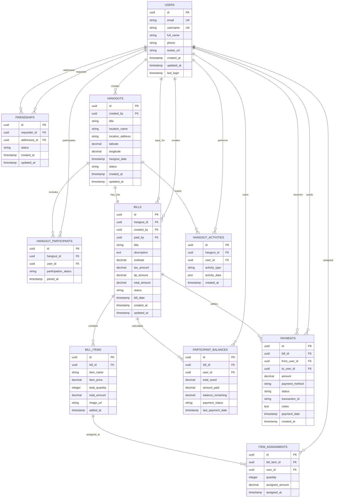

# Claude Split Bill App - Database Structure

## Overview

This document outlines the database structure for the Claude Split Bill App, a React Native application that allows users to create hangouts and split bills with friends. The app features drag-and-drop item assignment, payment tracking, and social functionality.

## Core Features Supported

- **User Authentication & Management**: Registration, login, profile management
- **Social Features**: Friend requests, friend management, nearby friends discovery
- **Hangout Management**: Create hangouts at locations where friends gather
- **Bill Creation & Management**: Each hangout has one bill with scanned/added items
- **Item Assignment**: Drag-and-drop interface to assign bill items to participants with quantity support
- **Payment Tracking**: Track who owes money to the bill payer, payment statuses, and settlement
- **Activity Logging**: Track all hangout and bill-related activities for audit and timeline purposes

## Database Schema

### Entity Relationship Diagram



## Table Specifications

### 1. USERS
Core user account information managed by Supabase Auth.

| Column | Type | Constraints | Description |
|--------|------|-------------|-------------|
| id | uuid | PRIMARY KEY | Unique user identifier (matches Supabase auth.users.id) |
| email | string | UNIQUE, NOT NULL | User's email address |
| username | string | UNIQUE | Optional username for display |
| full_name | string | | User's display name |
| phone | string | | User's phone number |
| avatar_url | string | | URL to user's profile picture |
| created_at | timestamp | DEFAULT now() | Account creation timestamp |
| updated_at | timestamp | DEFAULT now() | Last profile update |
| last_login | timestamp | | Last login timestamp |

**Indexes:**
- `idx_users_email` on `email`
- `idx_users_username` on `username`

### 2. FRIENDSHIPS
Manages friend relationships between users.

| Column | Type | Constraints | Description |
|--------|------|-------------|-------------|
| id | uuid | PRIMARY KEY | Unique friendship identifier |
| requester_id | uuid | FK to USERS(id), NOT NULL | User who sent the friend request |
| addressee_id | uuid | FK to USERS(id), NOT NULL | User who received the friend request |
| status | string | NOT NULL | 'pending', 'accepted', 'declined', 'blocked' |
| created_at | timestamp | DEFAULT now() | Friend request timestamp |
| updated_at | timestamp | DEFAULT now() | Status change timestamp |

**Constraints:**
- UNIQUE(requester_id, addressee_id)
- CHECK(requester_id != addressee_id)

**Indexes:**
- `idx_friendships_requester` on `requester_id`
- `idx_friendships_addressee` on `addressee_id`
- `idx_friendships_status` on `status`

### 3. HANGOUTS
Represents a social gathering where friends meet and split a bill.

| Column | Type | Constraints | Description |
|--------|------|-------------|-------------|
| id | uuid | PRIMARY KEY | Unique hangout identifier |
| created_by | uuid | FK to USERS(id), NOT NULL | User who created the hangout (bill scanner) |
| title | string | NOT NULL | Hangout title/name |
| location_name | string | | Name of the location (restaurant, venue, etc.) |
| location_address | string | | Address of the location |
| latitude | decimal(10,8) | | GPS latitude coordinate |
| longitude | decimal(11,8) | | GPS longitude coordinate |
| hangout_date | timestamp | NOT NULL | When the hangout occurred |
| status | string | DEFAULT 'active' | 'active', 'completed', 'cancelled' |
| created_at | timestamp | DEFAULT now() | Hangout creation timestamp |
| updated_at | timestamp | DEFAULT now() | Last update timestamp |

**Indexes:**
- `idx_hangouts_created_by` on `created_by`
- `idx_hangouts_status` on `status`
- `idx_hangouts_date` on `hangout_date`
- `idx_hangouts_location` on `latitude, longitude`

### 4. HANGOUT_PARTICIPANTS
Users participating in a specific hangout.

| Column | Type | Constraints | Description |
|--------|------|-------------|-------------|
| id | uuid | PRIMARY KEY | Unique participant record identifier |
| hangout_id | uuid | FK to HANGOUTS(id), NOT NULL | Hangout this participation relates to |
| user_id | uuid | FK to USERS(id), NOT NULL | Participating user |
| participation_status | string | DEFAULT 'active' | 'invited', 'active', 'left' |
| joined_at | timestamp | DEFAULT now() | When user joined the hangout |

**Constraints:**
- UNIQUE(hangout_id, user_id)

**Indexes:**
- `idx_hangout_participants_hangout` on `hangout_id`
- `idx_hangout_participants_user` on `user_id`
- `idx_hangout_participants_status` on `participation_status`

### 5. BILLS
The bill associated with a hangout (one bill per hangout).

| Column | Type | Constraints | Description |
|--------|------|-------------|-------------|
| id | uuid | PRIMARY KEY | Unique bill identifier |
| hangout_id | uuid | FK to HANGOUTS(id), NOT NULL | Hangout this bill belongs to |
| created_by | uuid | FK to USERS(id), NOT NULL | User who scanned/created the bill |
| paid_by | uuid | FK to USERS(id), NOT NULL | User who paid the bill (others owe this person) |
| title | string | NOT NULL | Bill title/description |
| description | text | | Additional bill details |
| subtotal | decimal(10,2) | DEFAULT 0 | Sum of all item prices |
| tax_amount | decimal(10,2) | DEFAULT 0 | Tax amount |
| tip_amount | decimal(10,2) | DEFAULT 0 | Tip amount |
| total_amount | decimal(10,2) | NOT NULL | Final total amount paid |
| status | string | DEFAULT 'active' | 'active', 'settled', 'cancelled' |
| bill_date | timestamp | NOT NULL | When the bill was created/scanned |
| created_at | timestamp | DEFAULT now() | Bill creation timestamp |
| updated_at | timestamp | DEFAULT now() | Last update timestamp |

**Constraints:**
- UNIQUE(hangout_id) - One bill per hangout

**Indexes:**
- `idx_bills_hangout` on `hangout_id`
- `idx_bills_created_by` on `created_by`
- `idx_bills_paid_by` on `paid_by`
- `idx_bills_status` on `status`
- `idx_bills_date` on `bill_date`

### 6. BILL_ITEMS
Individual items from the scanned/added bill.

| Column | Type | Constraints | Description |
|--------|------|-------------|-------------|
| id | uuid | PRIMARY KEY | Unique bill item identifier |
| bill_id | uuid | FK to BILLS(id), NOT NULL | Bill this item belongs to |
| item_name | string | NOT NULL | Name of the item |
| item_price | decimal(10,2) | NOT NULL | Price per unit of the item |
| total_quantity | integer | NOT NULL, DEFAULT 1 | Total quantity of this item |
| total_amount | decimal(10,2) | NOT NULL | item_price * total_quantity |
| image_url | string | | URL to item image (if available) |
| added_at | timestamp | DEFAULT now() | When item was added to bill |

**Indexes:**
- `idx_bill_items_bill` on `bill_id`

### 7. ITEM_ASSIGNMENTS
Tracks which users are assigned portions of each bill item (supports sharing).

| Column | Type | Constraints | Description |
|--------|------|-------------|-------------|
| id | uuid | PRIMARY KEY | Unique assignment identifier |
| bill_item_id | uuid | FK to BILL_ITEMS(id), NOT NULL | Bill item being assigned |
| user_id | uuid | FK to USERS(id), NOT NULL | User assigned to this portion |
| quantity | integer | NOT NULL, DEFAULT 1 | Quantity assigned to this user |
| assigned_amount | decimal(10,2) | NOT NULL | Amount this user owes for this assignment |
| assigned_at | timestamp | DEFAULT now() | When assignment was made |

**Constraints:**
- UNIQUE(bill_item_id, user_id)

**Indexes:**
- `idx_item_assignments_bill_item` on `bill_item_id`
- `idx_item_assignments_user` on `user_id`

### 8. PARTICIPANT_BALANCES
Tracks what each participant owes and has paid for the bill.

| Column | Type | Constraints | Description |
|--------|------|-------------|-------------|
| id | uuid | PRIMARY KEY | Unique balance record identifier |
| bill_id | uuid | FK to BILLS(id), NOT NULL | Bill this balance relates to |
| user_id | uuid | FK to USERS(id), NOT NULL | User whose balance is tracked |
| total_owed | decimal(10,2) | NOT NULL, DEFAULT 0 | Total amount user owes based on assignments |
| amount_paid | decimal(10,2) | NOT NULL, DEFAULT 0 | Amount user has paid so far |
| balance_remaining | decimal(10,2) | NOT NULL, DEFAULT 0 | Remaining amount to be paid |
| payment_status | string | DEFAULT 'pending' | 'pending', 'partial', 'paid', 'settled' |
| last_payment_date | timestamp | | When last payment was made |

**Constraints:**
- UNIQUE(bill_id, user_id)
- CHECK(balance_remaining = total_owed - amount_paid)

**Indexes:**
- `idx_participant_balances_bill` on `bill_id`
- `idx_participant_balances_user` on `user_id`
- `idx_participant_balances_status` on `payment_status`

### 9. PAYMENTS
Records of money transfers from participants to the bill payer.

| Column | Type | Constraints | Description |
|--------|------|-------------|-------------|
| id | uuid | PRIMARY KEY | Unique payment identifier |
| bill_id | uuid | FK to BILLS(id), NOT NULL | Bill this payment settles |
| from_user_id | uuid | FK to USERS(id), NOT NULL | User making the payment |
| to_user_id | uuid | FK to USERS(id), NOT NULL | User receiving the payment (bill payer) |
| amount | decimal(10,2) | NOT NULL | Payment amount |
| payment_method | string | | 'cash', 'venmo', 'paypal', 'bank_transfer', etc. |
| status | string | DEFAULT 'pending' | 'pending', 'completed', 'failed', 'cancelled' |
| transaction_id | string | | External transaction ID (from payment processor) |
| notes | text | | Additional payment notes |
| payment_date | timestamp | | When payment was made |
| created_at | timestamp | DEFAULT now() | Payment record creation |

**Constraints:**
- CHECK(from_user_id != to_user_id)
- CHECK(amount > 0)

**Indexes:**
- `idx_payments_bill` on `bill_id`
- `idx_payments_from_user` on `from_user_id`
- `idx_payments_to_user` on `to_user_id`
- `idx_payments_status` on `status`

### 10. HANGOUT_ACTIVITIES
Activity log for audit trail and timeline features.

| Column | Type | Constraints | Description |
|--------|------|-------------|-------------|
| id | uuid | PRIMARY KEY | Unique activity identifier |
| hangout_id | uuid | FK to HANGOUTS(id), NOT NULL | Hangout this activity relates to |
| user_id | uuid | FK to USERS(id) | User who performed the activity |
| activity_type | string | NOT NULL | Type of activity (see Activity Types below) |
| activity_data | json | | Additional data specific to activity type |
| created_at | timestamp | DEFAULT now() | When activity occurred |

**Activity Types:**
- `hangout_created`
- `participant_added`
- `participant_removed`
- `bill_scanned`
- `item_added`
- `item_removed`
- `item_assigned`
- `item_unassigned`
- `payment_made`
- `bill_settled`
- `hangout_completed`

**Indexes:**
- `idx_hangout_activities_hangout` on `hangout_id`
- `idx_hangout_activities_user` on `user_id`
- `idx_hangout_activities_type` on `activity_type`
- `idx_hangout_activities_created` on `created_at`

## Key Relationships & Data Flow

### Hangout & Bill Splitting Workflow
1. **Hangout Creation**: User creates a hangout at a location (restaurant, venue, etc.)
2. **Add Participants**: Invite friends to join the hangout
3. **Bill Scanning**: Creator or participant scans the bill and creates bill record
4. **Add Items**: Add items from the scanned bill or manually add items
5. **Assign Items**: Use drag-and-drop to assign items (with quantities) to participants
6. **Calculate Balances**: System calculates who owes what to the bill payer based on assignments
7. **Make Payments**: Participants pay the bill payer directly through various payment methods
8. **Track Activities**: All actions are logged for transparency and timeline view

### Key Business Rules
- **One Bill Per Hangout**: Each hangout has exactly one bill
- **Bill Payer vs Creator**: The person who scans/creates the bill can be different from who paid it
- **Shared Items**: Items can be shared between multiple participants with different quantities
- **Payment Direction**: All payments flow from participants to the bill payer (not peer-to-peer)
- **Balance Tracking**: Each participant's balance is tracked separately (total owed, paid, remaining)

### Data Consistency Rules
- Total assigned quantities for a bill item cannot exceed the item's total quantity
- Sum of all item assignments for a participant determines their total owed amount
- `balance_remaining = total_owed - amount_paid` must always be maintained
- Payment amounts are validated against outstanding balances
- All activities are logged for audit trail

### Performance Considerations
- Indexes on frequently queried columns (user_id, hangout_id, bill_id, status fields)
- JSON fields for flexible activity data storage
- Denormalized fields (item_name, item_price) for historical accuracy
- Calculated fields (balance_remaining) for quick balance queries

## Integration with Supabase

This schema is designed to work with Supabase's built-in features:

### Authentication
- Uses Supabase Auth for user management
- `users.id` references `auth.users.id`
- Row Level Security (RLS) policies should be implemented for data access control

### Real-time Features
- Supabase Realtime can be used for live bill updates
- Subscribe to changes on bills, assignments, and payments for collaborative features

### Storage
- Profile pictures and menu item images can be stored in Supabase Storage
- URLs stored in `avatar_url` and `image_url` fields

## Recommended RLS Policies

```sql
-- Users can only see their own profile data
CREATE POLICY "Users can view own profile" ON users FOR SELECT USING (auth.uid() = id);

-- Users can only see hangouts they participate in
CREATE POLICY "Users can view participated hangouts" ON hangouts FOR SELECT 
USING (id IN (SELECT hangout_id FROM hangout_participants WHERE user_id = auth.uid()));

-- Users can only see bills from hangouts they participate in
CREATE POLICY "Users can view participated bills" ON bills FOR SELECT 
USING (hangout_id IN (SELECT hangout_id FROM hangout_participants WHERE user_id = auth.uid()));

-- Users can only see their friends
CREATE POLICY "Users can view friends" ON friendships FOR SELECT 
USING (requester_id = auth.uid() OR addressee_id = auth.uid());

-- Users can only see their own balances
CREATE POLICY "Users can view own balances" ON participant_balances FOR SELECT 
USING (user_id = auth.uid());

-- Users can only see payments they sent or received
CREATE POLICY "Users can view own payments" ON payments FOR SELECT 
USING (from_user_id = auth.uid() OR to_user_id = auth.uid());
```

## Summary

This updated database structure correctly reflects the Claude Split Bill App's hangout-centric model:

✅ **Hangouts as Central Concept**: Social gatherings where friends meet and split bills

✅ **One Bill Per Hangout**: Each hangout contains exactly one bill that gets split

✅ **Flexible Roles**: Bill creator (scanner) and bill payer can be different people

✅ **Item Sharing**: Multiple participants can share items with specific quantities

✅ **Payment Tracking**: Clear tracking of who owes what to the bill payer

✅ **Activity Timeline**: Complete audit trail for the timeline feature shown in your HomeScreen

The database structure provides a solid foundation for the Claude Split Bill App, supporting all current features while being extensible for future enhancements.
